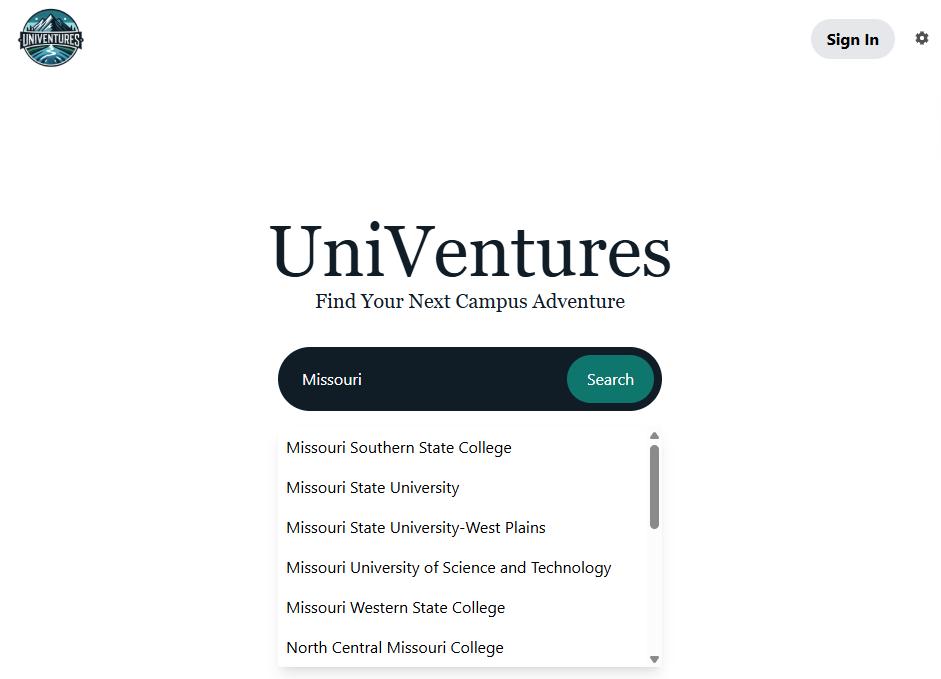

# UniVentures

**UniVentures** is a full-stack web application that helps college students discover and share local experiences tied to their university. By integrating real-time data from the Google Places API with community-submitted content, the platform allows users to explore what’s around campus, rate and review locations, and contribute their own adventures.

---

## Live Demo

Visit the deployed site: COMING SOON

---

## Features

- **University-Based Search**  
  Search any U.S. university by name. Campus information is automatically matched using OpenStreetMap and school domain data.

- **Public Adventures**  
  Discover real-world nearby locations using Google Places API, including restaurants, activities, stores, and more.

- **Community Adventures**  
  Users can submit custom adventures with a title, description, image, location, and category. All content is tied to a specific university.

- **Account System**  
  - Signup with `.edu` email (email verification required)  
  - Strong password enforcement  
  - Session-based authentication  
  - View and manage submitted reviews

- **Filtering and Ratings**  
  Filter adventures by type or minimum star rating. Submit 1–5 star ratings and text reviews for any location.

- **Contact Form**  
  Includes a contact page for user inquiries, routed to the UniVentures support email.

---

## Screenshots

*WORK IN PROGRESS*

Homepage (University Search):  


Adventure Listing and Filters:  


Submit an Adventure:  


+ a few more.

---

## Tech Stack

**Frontend**
- React
- Tailwind CSS

**Backend**
- Python (Flask)
- MySQL
- Flask-Mail
- Google Places API
- OpenStreetMap API (Nominatim)

---

## Database Overview

UniVentures uses two MySQL databases:

- `users`: stores user account credentials and metadata  
- `schools`: stores university listings, locations, ratings, and reviews

Each user is associated with a school via email domain. University geolocation data is retrieved using OpenStreetMap, and all adventures (public or submitted) are connected to a specific campus.

---

## Environment Variables

To run this project locally or in a development environment, create a `.env` file using the structure below.

```env
DB_HOST=localhost
DB_USER=root
DB_PASSWORD=your_mysql_password
DB_SCHOOLS=schools
DB_USERS=users

SECRET_KEY=your_flask_secret_key
SERIALIZER_SECRET=your_serializer_secret_key
ADMIN_SECRET_KEY=your_admin_key

MAIL_USERNAME=your_email@gmail.com
MAIL_PASSWORD=your_email_app_password

GOOGLE_API_KEY=your_google_maps_api_key
```

---

## Hosting Notes

This project can be deployed using any combination of static frontend hosting (such as Vercel), a Python-compatible backend service (such as Railway), and a cloud-hosted MySQL provider. Before deployment, update all environment variables with production credentials.

---

## Project Info

This was a final project developed for a Missouri State Software Engineering course in collaboration with two other team members. Their names have been omitted here for anonymity.

---

## License

This project is licensed under the [MIT License](LICENSE).
